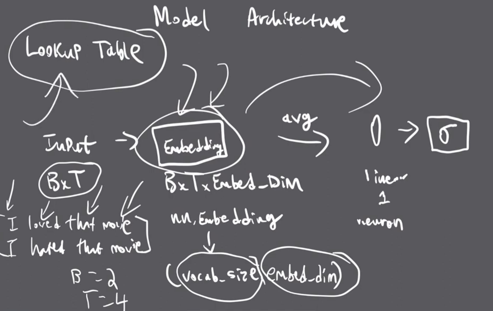
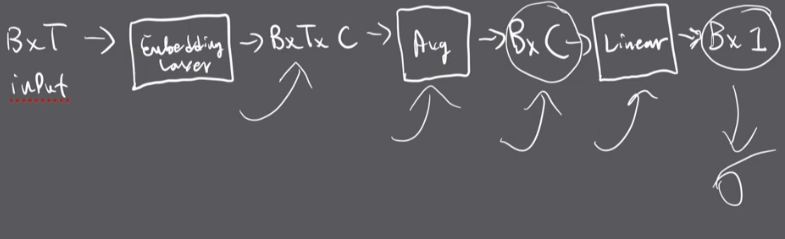

# GPT & Chill course notes and solutions
Disclaimer: These notes are for my personal use, if I find something extremely intuitive for myself, I might choose to not jot it down. 

# Gradient Descent
```python
class Solution:
    def get_minimizer(self, iterations: int, learning_rate: float, init: int) -> float:
        for i in range(iterations):
            d = 2 * init
            init -= learning_rate * d
        return round(init,5)
```

# Linear Regression

## Forward Pass
```python
import numpy as np
from numpy.typing import NDArray


# Helpful functions:
# https://numpy.org/doc/stable/reference/generated/numpy.matmul.html
# https://numpy.org/doc/stable/reference/generated/numpy.mean.html
# https://numpy.org/doc/stable/reference/generated/numpy.square.html

class Solution:
    
    def get_model_prediction(self, X: NDArray[np.float64], weights: NDArray[np.float64]) -> NDArray[np.float64]:
        # X is an Nx3 NumPy array
        # weights is a 3x1 NumPy array
        # HINT: np.matmul() will be useful
        # return np.round(your_answer, 5)
        return np.round(np.matmul(X,weights),5)


    def get_error(self, model_prediction: NDArray[np.float64], ground_truth: NDArray[np.float64]) -> float:
        # model_prediction is an Nx1 NumPy array
        # ground_truth is an Nx1 NumPy array
        # HINT: np.mean(), np.square() will be useful
        # return round(your_answer, 5)
        return np.round(np.mean(np.square(model_prediction-ground_truth)),5)

```

## Backward Pass
```python
import numpy as np
from numpy.typing import NDArray


class Solution:
    def get_derivative(self, model_prediction: NDArray[np.float64], ground_truth: NDArray[np.float64], N: int, X: NDArray[np.float64], desired_weight: int) -> float:
        # note that N is just len(X)
        return -2 * np.dot(ground_truth - model_prediction, X[:, desired_weight]) / N

    def get_model_prediction(self, X: NDArray[np.float64], weights: NDArray[np.float64]) -> NDArray[np.float64]:
        return np.squeeze(np.matmul(X, weights))

    learning_rate = 0.01

    def train_model(
        self, 
        X: NDArray[np.float64], 
        Y: NDArray[np.float64], 
        num_iterations: int, 
        initial_weights: NDArray[np.float64]
    ) -> NDArray[np.float64]:

        # you will need to call get_derivative() for each weight
        # and update each one separately based on the learning rate!
        # return np.round(your_answer, 5)
        for i in range(num_iterations):
            predictions = self.get_model_prediction(X, initial_weights)
            for j in range(3):
                initial_weights[j] -= self.learning_rate * self.get_derivative(predictions, Y, len(X), X, j)
        return np.round(initial_weights,5)
```

# Pytorch Basics
```python
import torch
import torch.nn
from torchtyping import TensorType

# Helpful functions:
# https://pytorch.org/docs/stable/generated/torch.reshape.html
# https://pytorch.org/docs/stable/generated/torch.mean.html
# https://pytorch.org/docs/stable/generated/torch.cat.html
# https://pytorch.org/docs/stable/generated/torch.nn.functional.mse_loss.html

# Round your answers to 4 decimal places using torch.round(input_tensor, decimals = 4)
class Solution:
    def reshape(self, to_reshape: TensorType[float]) -> TensorType[float]:
        # torch.reshape() will be useful - check out the documentation
        M, N = to_reshape.shape
        return to_reshape.reshape(((M * N) // 2, 2)).round(decimals=4)

    def average(self, to_avg: TensorType[float]) -> TensorType[float]:
        # torch.mean() will be useful - check out the documentation
        return torch.mean(to_avg, dim=0).round(decimals=4)
        
    def concatenate(self, cat_one: TensorType[float], cat_two: TensorType[float]) -> TensorType[float]:
        # torch.cat() will be useful - check out the documentation
        return torch.cat((cat_one, cat_two), dim=1).round(decimals=4)

    def get_loss(self, prediction: TensorType[float], target: TensorType[float]) -> TensorType[float]:
        # torch.nn.functional.mse_loss() will be useful - check out the documentation
        return torch.nn.functional.mse_loss(prediction, target).round(decimals=4)

```

# Digit Classifier
```python
import torch
import torch.nn as nn
from torchtyping import TensorType

class Solution(nn.Module):
    def __init__(self):
        super().__init__()
        torch.manual_seed(0)
        # Define the architecture here
        self.layer1 = nn.Linear(784, 512)
        self.relu = nn.ReLU()
        self.dropout = nn.Dropout(p=0.2)
        self.layer2 = nn.Linear(512, 10)
        self.sigmoid = nn.Sigmoid()
    
    def forward(self, images: TensorType[float]) -> TensorType[float]:
        torch.manual_seed(0)
        # Return the model's prediction to 4 decimal places
        first_layer = self.dropout(self.relu(self.layer1(images)))
        out = self.sigmoid(self.layer2(first_layer))
        return out.round(decimals=4)
```

# Sentiment Analysis
## Variable Definitions
$B$ = Batch size (number of examples we are processing in parallel)

$T$ = length of longest sentence or length of padded rectangular tensor. Ex. if first sentence of our input is "I loved that movie" and second sentence is "I hated that movie", the input size would be $2 \times 4$

$\text{vocab\_size}$ = number of tokens in vocabulary

$\text{embed\_dim} (C)$ = number of dimensions in the vector representation of the tokens.

$A$ = attention dimension or head size

$H$ = number of heads

## Embeddings
A learned vector representation of every token in our vocabulary. The embedding dimension is the size of the vector we learn for each vector, and the higher the number is, the more complex of a relationship the model can learn. Generally, after training, vectors of words that are semantically similar are closer together. To create the neural network to learn the embeddings in PyTorch, you need to pass in (vocab_size, embed_dim) into [nn.Embedding](https://pytorch.org/docs/stable/generated/torch.nn.Embedding.html). The embedding layer stores the embeddings into a lookup table to pass downstream into the model.

#### Lookup Table
The inputs of the embedding layer can be one-hot encoded using the vocab size and stacked into $T \times \text{vocab\_size}$ matrix. This is then multiplied by a $\text{vocab\_size} \times \text{embed\_dim}$ matrix that has the vector representations of each word of the vocabulary stacked on top of each other. This can we be viewed as a fully-connected layer with the input layer of vocab_size and output layer of size embed_dim, which means nn.Embedding is a wrapped around nn.Linear, but it can also just be interpreted as a lookup table that fetches the vector representation of each token in the input.

### Model Architecture


Average layer averages across the time-step dimension to get a vector of dimension $\text{embed\_dim}$ that every single sentence in that batch gets condensed into a vector that captures its overall semantic meaning. The linear layer predicts how positive or negative that sentence is based on its semantic meaning. The sigmoid layer normalizes this value to make the results more interpretable.

### Code
```python
import torch
import torch.nn as nn
from torchtyping import TensorType

class Solution(nn.Module):
    def __init__(self, vocabulary_size: int):
        super().__init__()
        torch.manual_seed(0)
        self.e = nn.Embedding(vocabulary_size, 16)
        self.l = nn.Linear(16, 1)
        self.sigmoid = nn.Sigmoid()

    def forward(self, x: TensorType[int]) -> TensorType[float]:
        # Hint: The embedding layer outputs a B, T, embed_dim tensor
        # but you should average it into a B, embed_dim tensor before using the Linear layer

        # Return a B, 1 tensor and round to 4 decimal places
        embeddings = torch.mean(self.e(x),dim=1) 
        output = self.sigmoid(self.l(embeddings))
        return output.round(decimals=4)

```

# Attention

## Summary of Single-Headed Attention
A layer in a neural network that will take in the embeddings of input tokens (matrix of size $T \times \text{embed\_dim}$) and will output a tensor of size $T \times A$ that encapsulates the relevant parts of the token the model needs to pay attention to.


## Multi-headed attention
Same as single-headed attention except each head's output size is $A / H$. The output of each head is concatenated on top of each other. MHA results in better model performance as each head of attention gets to operate on the input separately and in parallel. Each head can focus on different semantic aspects, such as one head focusing on direct object of verbs, another head focus on adjectives, etc..

## Key and Query
Each token in the input emits its own key and query. The key can be thought of as what the token offers semantically, while the query can be thought of as what that token is searching for. For ex. if a noun is searching for the adjective that describes it, then the noun's query might have a very similar vector the adjectives key. These vectors are calculated using linear regression prior to being fed into the attention layer. These two vectors are multiplied using a dot-product to produce a KQ matrix that displays which tokens should attend to which tokens. These Key and Query matrices are generated by a linear layer: nn.Linear(embedding_dim, A).

## Value
The KQ matrix is then multiplied by a value matrix that is also computed using a linear layer. This value matrix contains what's relevant for each token to share, as we do not necessarily want to share all of the semantic complexities of that token, but just what is relevant to the other tokens.

## Formula
$$\text{Attention}(Q, K, V) = \text{softmax}(\frac{QK^T}{\sqrt{d_k}})V$$
$$\text{MHA}(Q, K, V) = \text{concat}(\text{head}_1,...,\text{head}_h)W^O\\
\text{where head}_i = \text{Attention}(QW_i^Q, KW_i^K, VW_i^V)$$

Where the projects are parameter matrices $W_i^Q \in \mathbb{R}^{d_\text{model} \times d_k}$, $W_i^K \in \mathbb{R}^{d_\text{model} \times d_k}$, $W_i^V \in \mathbb{R}^{d_\text{model} \times d_v}$ and $W^O \in \mathbb{R}^{d_v \times d_\text{model}}$. Softmax is used to turn the values of the dot product into probabilities. For large values of $d_k$, the dot products grow large in magnitude, pushing the softmax function into regions where it has extremely small gradients. To counteract this, we use a scaling factor of $\frac{1}{d_k}$.