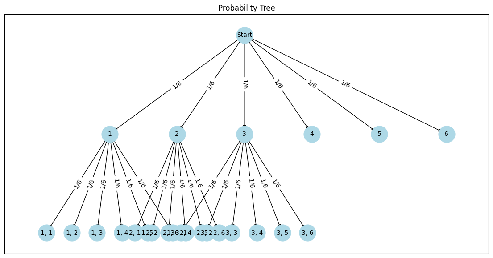

These are some of my solutions for the Quantable classic 75 question list. These problems are not my own and I highly suggest you check them out.

# Roll Again 1

## Question
Kelly rolls a fair standard 6-sided die. She observes the value on the face. Afterwards, she is given the option to either receive the upface (in dollars) as a payout or to roll again. If she rolls again, she receives the upface of the second roll (in dollars) as payout, regardless of what she rolled on the first turn. If Kelly plays optimally, what is her expected payout?

  
Answer

### Answer
The expected value of 1 roll is 

$$ E[\text{1 roll}] = \frac{1}{6} \cdot 1 + \frac{1}{6} \cdot 2 + \frac{1}{6} \cdot 3 + \frac{1}{6} \cdot 4 + \frac{1}{6} \cdot 5 + \frac{1}{6} \cdot 6 = 3.5$$

Kelly's optimal playing strategy is to reroll if she rolls a value lower than the expected value of 1 roll (1,2, or 3), and to cash-in on the first roll otherwise (rolling a 4,5, or 6). This is because if she chooses to roll again, she can expect to receive a payout of 3.5 in the second roll.

The event tree is shown below:

Thus, The expected value of such as strategy is shown below:

$$E[\text{optimal}] = \frac{1}{6} \cdot E[\text{1 roll}] + \frac{1}{6} \cdot E[\text{1 roll}] + \frac{1}{6} \cdot E[\text{1 roll}] + \frac{1}{6} \cdot 4 + \frac{1}{6} \cdot 5 + \frac{1}{6} \cdot 6 = \boxed{4.25}$$

# Groggy Froggy
## Question
A frog starts at the center of a circular lily pad of radius 1 meter. The frog hops to a uniformly random point on the lily pad. Find the expected radial distance of the frog from the center of the lily pad.

  
Answer

### Answer
Let $R$ denote a random variable that is the radial distance of the frog from the center of the circle. We would like to find the probability density function of R, which requires us to first find the cumulative distribution of R. To find this, we observe that the probability that the frog lands within a certain region of the circle is proportional to the area of that region.

$$F_R(r) = P(R \leq r) = \frac{\text{Area of circle of radius }r}{\text{Total area}} = \frac{\pi r^2}{\pi \cdot 1^2} = r^2 \text{ for } 0 \leq r \leq 1$$

The PDF $f_R(r)$ is the derivative of the CDF $F_R(r)$:
$$f_R(r) = \frac{d}{dr}F_R(r) = \frac{d}{dr}r^2 = 2r \text{ for } 0 \leq r \leq 1$$

The expected value $E[R]$ is the integral of $r$ times the PDF over the interval from 0 to 1:
$$E[R] = \int_0^1 r\cdot f_R(r)dr = \int^1_0 r\cdot 2rdr = 2 \int^1_0 r^2dr = 2\left[\frac{r^3}{3} \right]^1_0 = 2 \cdot \frac{1^3}{3} = \boxed{\frac{2}{3}}$$

# Birthday Circle
## Question
$n$ friends sit around a circular table of $n$ seats uniformly at random. Assume that each of the friends has a distinct age. Find the probability that they sit down at the table in age order when $n = 6$. This means that either clockwise or counter-clockwise, the ages of the people are in strictly increasing order.

  
Answer

### Answer
We first need to find the total number of permutations. For $n$ distinct individuals, the number of ways they can sit in a line is $n!$. However, since the arrangement is circular, we have to account for rotation symmetry. The number of distinct arrangements is $\frac{n!}{n} = (n-1)!$ The key intuition is that in circular permutations, the first person is considered a place holder, and where he sits does not matter. In another words, if we put one person at the "top" of the table, the the others can permute linearly ($n-1$) permutations. Another way to think about it that each circular arrangement of $n$ people corresponds to $n$ linear arrangements since for each circular arrangement we can rotate $n$ times clockwise and still have the same configuration.

Now that we found the number of distinct permutations, the questions becomes quite trivial as tehere are only two acceptable arrangements for age order (clockwise and counter-clockwise). The answer is thus $$\frac{2}{(n-1)!} = \frac{2}{5!} = \frac{2}{120} = \boxed{\frac{1}{60}}$$

# Cordial Handshake 1
### Question
A business meeting begins with 2 representatives from 5 different companies. If every person at the meeting shakes hands with every other person at the meeting, how many handshakes occur total?

  
Answer

### Answer
There are two ways to approach this problem. We can randomly select 1 person at random among $n=10$ people and have him shake hands with $n-1$ other people. This results in $n-1$ handshakes. We then select another person out of the remaining $n-1$ people and have him shake hands with everyone that he has not shaken hands with already. Since he has already only shaken hands with one other person, this results in $n-2$ handshakes. This pattern continues until there is only 1 handshake left to give. The sum is $(n-1)+(n-2)+...1 = \frac{(n)(n-1)}{2} = \frac{10 \cdot 9}{2} = \boxed{45}$

This sum could also be framed like so: each of the $n$ representative needs to shake hands with the other $n-1$ representatives. If we aren't worried about repeated handshakes, the total number of handshakes is $n(n-1)$. Since we are worried about repeated handshakes, we divide the result by 2 to avoid double-counting. Thus, the answer is $\frac{(n)(n-1)}{2} = \frac{10 \cdot 9}{2} = \boxed{45}$

# St. Petersburg 1
### Question
You are offered to play the following game: You flip a fair coin repeatedly until the first head appears. If the first heads appears on the $n$th flip, you received a payout of $$2^n$. What is the fair value of this game. 

  
Answer

### Answer
To find the fair value of this game, we need to compute the expected payout. The expected payout E is the sum of the products of the probability of each outcome and its corresponding payout. The probability of getting the first heads on the $n$-th flip is $(\frac{1}{2})^n$. This is because you need $n-1$ tails followed by 1 head, each with probability $\frac{1}{2}$ The expected value can be expressed as an infinite series.
$$E[X] = \sum_{n=1}^{\infty}2^n\left(\frac{1}{2}\right)^n=\sum_{n=1}^{\infty}\left(\frac{2}{2}\right)^n= \sum_{n=1}^{\infty}1 = \boxed{\infty}$$

# Greater Dice
### Question
You have two fair dice. One of them is $m$-sided, while the other is $n$-sided. The dice have respective values 1-$m$ and 1-$n$ on the sides. Suppose that $n > m$. Find the probability that the $n$-sided die shows a strictly larger value than the $m$-sided die. Solve this with $m=20$ and $n=30$.

  
Answer

### Answer

Let $D_{20}$ be the value on the 20-sided die, and $D_{30}$ be the value on the 30-sided die. We want to calculate teh probability that $D_{30} > D_{20}$. The total number of outcomes when rolling both dice is the product of the number of sides on each die: $20 \times 30 = 600$

We need to count the number of outcomes where the value of the 30-sided die is strictly greater than the value of the 20-sided die. We can do this by considering each possible value of $D_{20}$:

- If $D_{20} = 1$, $D_{30}$ can be 29 values (2-30).
- If $D_{20} = 2$, $D_{30}$ can be 28 values (3-30).
...
- If $D_{20} = 20$, $D_{30}$ can be 10 values (21-30).

So the number of favorable outcomes is 
$$29+...+10 = (29+...+1)  - (9+...+1) = \frac{(29)(30)}{2} - \frac{(9)(10)}{2} = \frac{1}{2} (870-90)= 390$$

Thus, our answer is $\frac{390}{600} = \boxed{\frac{13}{20}}$

# 60 Heads 1
### Question
A fair coin is flipped 100 times. Using the Central Limit Theorem without continuity correction, estimate the probability that at least 60 heads are obtained. The answer is in form $\Phi(a)$ for some $a$, where $\Phi$ is the standard normal distribution CDF. Find $a$.

  
Answer

### Answer

Let $n=100$ and $p=0.5$. According to the CLT, for a larger number of trials, the binomial distribution can be approximated by a normal distribution with mean $\mu = np = 100 \times 0.5 = 50$ and standard deviation $\sigma = \sqrt{np(1-p)} = \sqrt{100 \times 0.5 \times 0.5} = 5$. 

We need to find the probability $P(X \geq 60)$. Using the normal approximation, this is equivalent to finding $P(Z \geq 2)$ where $Z$ is a standard normal variable.
Hence,
$$
P(X \geq 60) \approx P(Z \geq 2) = 1 - \Phi(2)
$$

$\Phi(z) = 1- \Phi(-2)$ is true because the standard normal distribution's CDF is symmetric around the mean (0), which means that the probability of a standard normal variable being less than or equal to $z$ is equal to the probability of it being greater than or equal to $-z$. Thus,
$$ 1 - \Phi(2) = \Phi(-2) \Rightarrow a =\boxed{-2}$$

# Longer Piece 1
### Question
Suppose that you have a loaf of bread that is 1 meter in length. You slice the piece of bread at a uniformly random point along its length, creating 2 slices. Find the expected length (in meters) of the longest piece of bread. 

  
Answer

### Answer

Let’s denote the position where the bread is sliced by $X$ , where $X$ is a random variable uniformly distributed between 0 and 1 (representing the position along the 1 meter length of the bread). To find the expected length of the longer piece, we first determine the length of the longer piece given a slice at $X$: $L = \max(X, 1 - X)$ The expected value of L can be computed by integrating over the entire range of X from 0 to 1. Specifically: $E[L] = \int^1_0 \text{max}(X,1-X)dX$. Since this function is not differentiable at $X = 0.5$, we split up this integral since from $0 \leq X \leq 0.5$, the longer piece is $1-X$. For $0.5 < X \leq 1$, the longer piece is X.
Thus, 
$$
E[L] = \int^{0.5}_{0} (1-X)dX + \int^{1}_{0.5} XdX = \left[ X - \frac{X^2}{2}\right]^{0.5}_0 + \left[\frac{X^2}{2}\right]^1_{0.5} 
$$
$$= \left(0.5 - \frac{0.5^2}{2}\right) + \left(\frac{1^2}{2} - \frac{0.5^2}{2}\right) = 0.375+0.375 = \boxed{0.75} 
$$

# Coin Swap 1
### Question
Alice and Bob play a game with a coin with probability $0 < p \leq 1$ of heads per flip.  Alice starts with the coin and flips it. The game stops when someone flips a heads. If either player flip a tails, they pass the coin to the other player for them to flip. Find the probability that Alice is the winner when $p = \frac{1}{3}$

  
Answer

### Answer

There are two approaches to this question:

One involves abusing the fact that the game is recursive and really only has two game states. Let $P(A)$ denote the probability that the player that flips first wins, which happens to be what we are looking for since Alice flips first. At the start of the game, Bob's win probability is $1-P(A)$. This is the first game state. The initial flip by Alice leads to 2 possible outcomes: Alice can win outright with a probability of $p$, or Alice passes the coin to Bob with the probability of $1-p$. If this outcome occurs, the game enters the second state, where Bob flips. Now, using some mental gymnastics, we can observe that this second game state is identical to the first game state except the fact that the person with the initial flip is Bob. Thus Bob's win probability becomes $P(A)$ and Alice's win probability is $1-P(A)$, since Bob is the initial coin flipper. Until the game concludes, the game will always alternate between these two states. Alice wins if she flips heads initially, which happens with probability p, and if Alice flips tails (probability $1-p$), then Bob flips the coin, and the probability that Alice wins from this state where Bob starts is $1-P(A)$.
Thus, $P(A) = p+(1-p)(1-P(A))$, and solving this equation with $p=\frac{1}{3}$ gives us $\boxed{\frac{3}{5}}$

 Another solution involves summing up the probabilities of the scenarios where Alice wins. The quickest scenario is  when Alice rolls heads outright, and the probability this occurs is $\frac{1}{3}$. The next fastest scenario is when Alice rolls tails, Bobs rolls tails, and Alice rolls heads. The probability this occurs is $\frac{2}{3} \cdot \frac{2}{3} \cdot \frac{1}{3}$. The next fastest scenario occurs when outcomes goes tails, tails, tails, tails, heads, and the probability of this is $\frac{2}{3} \cdot \frac{2}{3} \cdot \frac{2}{3} \cdot \frac{2}{3} \cdot  \frac{1}{3}$... The sum of these probabilities can be expressed as so 
$$
\frac{1}{3}\sum_{n=0}^{\infty}\left(\frac{4}{9}\right)^n = \frac{1}{3} \left(\frac{1}{1-\frac{4}{9}}\right) = \boxed{\frac{3}{5}}
$$

# LinkedIn Networking 1
### Question
You message $N$  quant researchers on LinkedIn in an attempt to get a referral. You created a personalized message for each, but forgot which one corresponds to each person. Therefore, you send each of them a random message, with each message being used exactly once. Find the expected number of quant researchers that receive the message you intended for them when $N = 20$

  
Answer

### Answer
Let $X_i$ be a random variable indicating whether the $i$=th researcher receives the correct message. $X_i=1$ if the researcher receives the correct message, and $X_i=0$ otherwise. The probability that the $i$-th researcher receives the correct message is $\frac{1}{N}$. Therefore, the expected value of $X_i$ is: $E[X_i] = \frac{1}{N}$. Let $X$ be the total number of researchers who receive the correct message. Then, $X = X_1+X_2+...+X_N$ BY the linearity of expectation, $E[X] = E[X_1+X_2+...+X_N] = E[X_1]+E[X_2]+...+E[X_N]= N \cdot \frac{1}{N} = \boxed{1}$

# Consecutive 1
### Question
On average, how many times must a fair standard die be rolled to obtain two consecutive 1s.

  
Answer

### Answer

We can use Markov chains to solve this problem. This game has three game states. Let State 0 denote the start of the game, State 1 denote the state  where a 1 has been rolled, and State 2 where two ones have been rolled, which is the absorption state. Let $E_0$ be the expected number of rolls from the start to get two consecutive 1's, and $E_1$ be the expected number of rolls after having rolled one 1 (but not two consecutive 1’s). From state 0, there is a $\frac{1}{6}$ probability on entering state 1, and a $\frac{5}{6}$ probability of staying in state 0. From state 1, there is a $\frac{1}{6}$ probability to enter the absorption state, and a $\frac{5}{6}$ opportunity of returning to state 0. Thus, we can setup the following equations:
$$E_2=0$$
$$E_0=1+\frac{1}{6}E_1+\frac{5}{6}E_0$$
$$E_1=1+\frac{1}{6}E_2+\frac{5}{6}E_0$$

We can solve this system of equations for $E_0$, which would give us $E_0 = \boxed{42}$

# Less Than Exponential
### Question
Suppose $X \sim \text{Exp}(\lambda_1)$ and $Y \sim \text{Exp}(\lambda_2)$ are independent. Find $\mathbb{P}[X<Y]$ when $\lambda_1=4$ and $\lambda_2=6$

  
Answer

### Answer

For an exponential random variable $X \sim \text{Exp}(\lambda_1)$, the CDF is given by:
$$F_X(x) = P(X \leq x) = 1-e^{-\lambda x}, x \geq 0$$

We want to find $$P[X < Y] = \int_0^{\infty}P[X<Y|Y=y]f_\text{Y}(y)dy$$ Since $X$ and $Y$ are independent, $$P[X<Y|Y=y]=P[X<y]$$ The CDF of $X$ evaluated at $y$ is $F_x(y)$

$$P(X < y) = F_x(y) = 1-e^{-\lambda_1y}$$

For $Y \sim \text{Exp}(\lambda_2)$, the PDF is $$f_Y(y)=\lambda_2e^{-\lambda_2y}, y \geq 0$$

$$P[X < Y] = \int_0^{\infty}(1-e^{-\lambda_1y})\lambda_2e^{-\lambda_2y}dy = 1 - \frac{\lambda_2}{\lambda_1+\lambda_2} = \frac{\lambda_1}{\lambda_1+\lambda_2} = \boxed{0.4}$$

# Miami Hurricanes
### Question
A family has a sign with the letters MIAMI on the front. A hurricane hits Miami for the 10th time this year, so two random letters have fallen off this sign. A tourist that isn't from Miami notices this and and glues the letters back up at random. Find the probability that the sign reads MIAMI again.

  
Answer

### Answer

Let $X$ denote the event where the sign reads Miami again. In this problem, we have 2 mutually exclusive cases. The first case is if the letters that fell are the same (both Ms or both Is). The second case is if the letters that fell are different. 

The probability that case 1 occurs is $P(\text{Case 1}) = \frac{2}{\binom{5}{2}} = \frac{1}{5}$ because there are $\binom{5}{2}$ ways to pick 2 letters from 5 letters, and there are only 2 ways of picking the same letter. If Case 1 occurs, it is guaranteed that the sign reads MIAMI, so $P(X | \text{Case 1}) = 1$. Thus, $P(X \cap \text{Case 1}) = \frac{1}{5} \cdot 1 = \frac{1}{5}$

The probability that case 2 occurs is $P(\text{Case 2}) = 1 - P(\text{Case 1}) = 1 - \frac{1}{5} = \frac{4}{5}$. If Case 2 occurs, there is a 50% chance that the sign will read MIAMI (the letters will be either arranged correctly or swapped) so $P(X | \text{Case 2}) = \frac{1}{2}$. Thus, $P(X \cap \text{Case 2}) = \frac{4}{5} \cdot \frac{1}{2} = \frac{2}{5}$

Finally,
$$P(X) = P(X \cap \text{Case 1}) + P(X \cap \text{Case 2}) = \frac{1}{5} + \frac{2}{5} = \boxed{\frac{3}{5}}$$

# Monty Hall 1
### Question
You  made it onto a game show! The host presents you with $n \geq 3$ doors. One door contains a prize, while the other $n-1$ doors are empty. The prize is uniformly random between the doors. You choose an initial door. Afterwards, the host opens a door (not the one you selected) which he knows has no prize behind it. You then are given the option to switch your door. Find the probability that you find the prize if you switch when $n=8$.

  
Answer

### Answer

 Let $X$ denote the random variable where the prize is in your first pick and $C$ denote the random variable where you pick correctly if we are switch. By definition, $P(C|X) = 0$. In your first selection, you have a $P(X) = \frac{1}{n} = \frac{1}{8}$ chance of picking the correct door. Thus, there is a $P(X') = \frac{n-1}{n} = \frac{7}{8}$ chance that the prize is in any of the door other doors. Now, the game show host kindly gets rid of one of the remaining doors for us. So now, if we were to switch and the prize was not in the initial pick, we would have a $P(C|X') = \frac{1}{n-2} = \frac{1}{6}$ chance of picking the correct door. Thus $$P(C) = P(C|X)P(X) + P(C|X')P(X') = 0 + \left(\frac{1}{6}\right) \left(\frac{7}{8}\right) = \boxed{\frac{7}{48}}$$

# Disease Prevalence 1
### Question
The prevalence of a disease within a population is $1$%. A test for the disease is created. If the person has the disease, there is a $99$% chance they test positive. If they don't have the disease, there is still a false positive rate of $3$%. Find the probability a person actually has the disease if they test positive.

  
Answer

### Answer

Let $D$ denote the random variable of a person having the disease and $T^{+}$ denote the the random variable of a positive test result.
To solve this problem we will use Bayes Theorem, which to fit in our case would be $$P(D | T^{+}) = \frac{P(T^{+}|D) \cdot P(D)}{P(T+)} = \frac{P(T^{+}|D) \cdot P(D)}{(P(T^{+}|D) \cdot P(D)) + (P(T^{+}|D') \cdot P(D'))} $$
$$= \frac{0.99 * 0.01}{0.99 * 0.01 + 0.03 * 0.99} = \boxed{\frac{1}{4}}$$

# Dart Covariance
### Question
Maddie is throwing darts at a very realistic dartboard that is infinitely tall and wide. Let $(0,0)$ be the exact center of the bullseye. Let $X$ and $Y$ represent the horizontal and vertical distance that Maddie's dart lands from the bullseye, respectively. This means that Maddie's shot is a random point $(X,Y) \in \mathbb{R}^2$. Assume that $X,Y \sim N(0,1)$ IID. Let $R$ be the (Euclidean) distance from the origin that the dart lands. Compute $\text{Cov}(X,R^2)$.

  
Answer

### Answer

We are given that $X \sim N(0,1)$, $Y \sim N(0,1)$, and $X$ and $Y$ are independent. We can also observe that $R^2 = X^2 + Y^2$. We want to find $\text{Cov}(X,R^2) = E[XR^2] - E[X]E[R^2]$

We start with $E[X] = 0$ since $X$ is a standard normal variable with mean 0. $E[R^2] = E[X^2] + E[Y^2]$. Since $X^2$ and $Y^2$ are normally distributed and $E[X^2] = \text{Var}(X) = 1$, $E[R^2] = 1 + 1 = 
2$

Now, just need to calculate $E[XR^2]$

$$E[XR^2] = E[X(X^2 + Y^2)] = E[X^3] + E[XY^2]$$
$E[X^3] = E[X]E[X^2] = 0 \times 1 = 0$. Since $X$ and $Y$ are independent, $E[XY^2]=E[X]E[Y^2] = 0$ since $E[X]=0$. Thus, $\text{Cov}(X,R^2) = E[XR^2]-E[X]E[R^2] = \boxed{0}$

# Strictly Increasing Dice
### Question
You have four regular six-sided dice that you roll one after the other. What is the probability that your rolls form a strictly increasing sequence?

  
Answer

### Answer

The number of possible sequences is $6^4 = 1296$. Now, to count the number of strictly increasing sequences of rolling four dice, we can first observe that is equivalent to finding the number of ways to choose 4 distinct numbers from the set {$1,2,...,6$}. This is because if we randomly pick out four distinct numbers from that set, we are only interested in the one configuration where they are in strictly increasing order. Since combinations are order-invariant ({$1,2,3,4$} and {$4,3,2,1$} are not double-counted), $\binom{6}{4}$ will give us the number of sequences we are interested in. Thus, the answer is $\frac{\binom{6}{4}}{6^4} = \frac{\frac{6!}{4!2!}}{1296} = \boxed{\frac{15}{1296}}$

